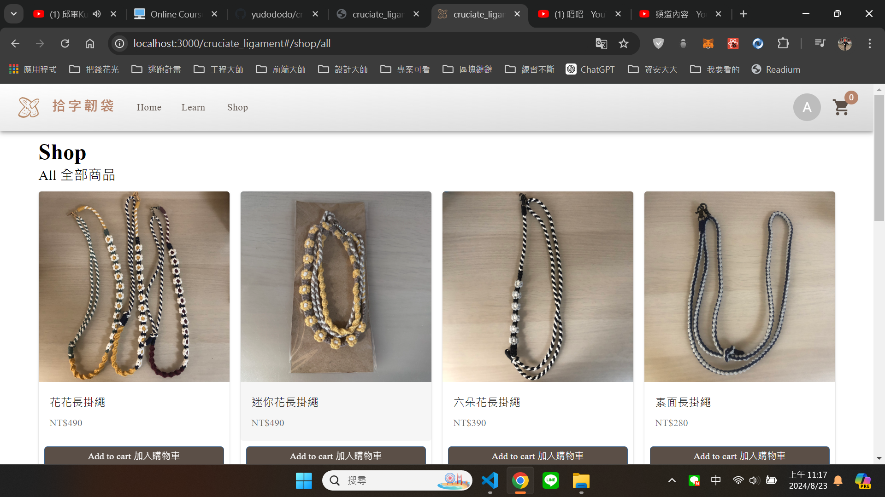
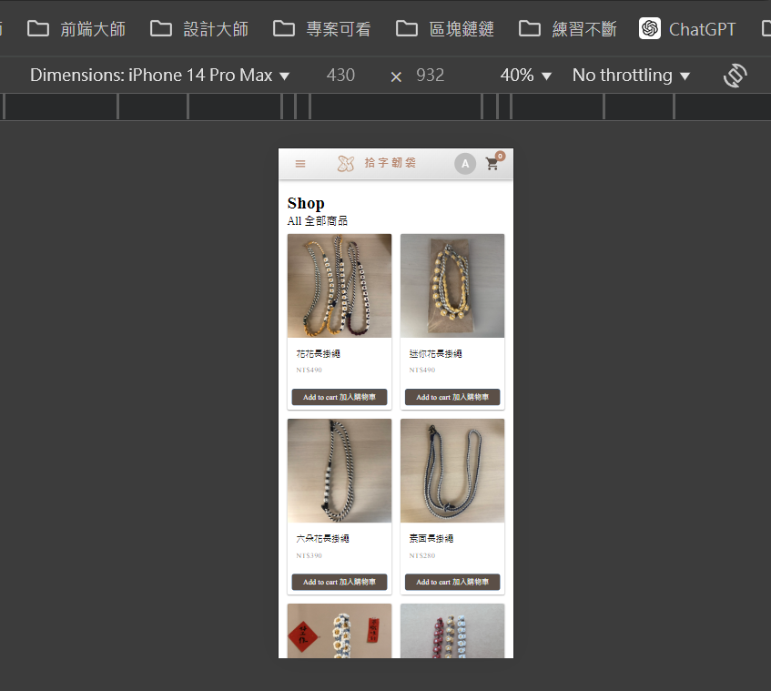

## Overview👀

打排球造成前十字韌帶斷裂，開刀後多了很多時間在家休養，看著 Youtube 學編織，發現編織很好玩，
因此為自己的品牌"拾字韌袋"創了一個購物商城✿✿✿

<a href="https://www.figma.com/design/ctRkPfFX0ZszZKhPUu02te/cruciate_ligament?node-id=0-1&t=Y2fHmCLBtg2tne3p-1">
 點擊觀看 figma 流程圖
</a>

## Screenshot🐻💥

<a href="https://youtu.be/5ghNjXHNMZA">
 
  
 
  
 點擊觀看 demo 影片
</a>

## The challenge🔥

拾字韌袋網站，為喜愛手作品的客人提供網頁查看商品，具完整前後台架構。

(勾選✅為已完成項目)

用戶前台：
- 產品列表、單一產品呈現 ✅
- 加入購物車 ✅
- 表單驗證

用戶後台：
- 基本資料修改 (頁面✅)
- 訂單查詢 (頁面✅)

管理者後台：
- 登入驗證
- 授權管理、路由保護
- 資料新增、編輯、刪除
- 產品、優惠卷、訂單管理
